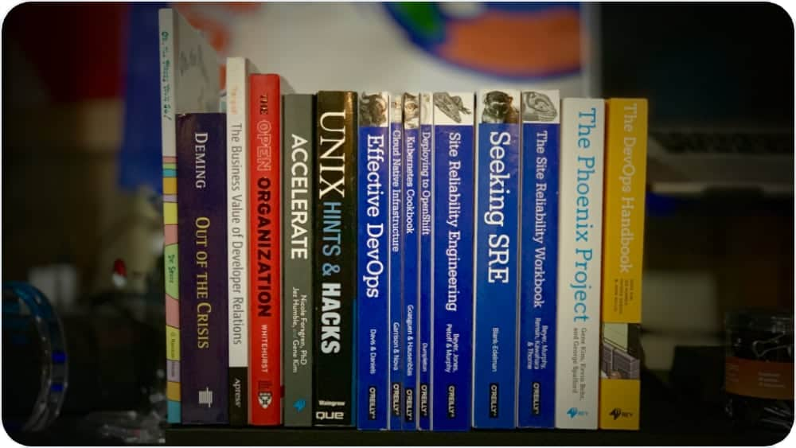

+++
author = "Chris Short"
categories = [""]
date = 2019-08-27T07:00:00Z
description = ""
draft = true
tags = [""]
url = "office-bookshelf"
title = "What's on my office bookshelf"
image = "/office-bookshelf/office-bookshelf.jpg"

+++

There are some books that you buy to study or enjoy, some you buy to reference, and some you buy because you're "supposed" to have them. We end up collecting some books over time. But, there are some books that you want to have close by for one reason or another. For me, if there is a book I  keep close by it's because I actually need it handy for one reason or another.



I'm very lucky that I work from home. My office takes up a section of our unfinished basement. There is ample work space but, there isn't infinite space for books. Let's dive into each book and why they are on the tiny shelf space I have available in my office.

## Oh, the Places You'll Go!

I was given a copy of [Oh, the Places You'll Go! by Dr. Seuss](https://amzn.to/2KSodab) when I moved to Detroit. Inside the cover the General Manager of the company I joined wrote a very inspiring message. The company was acquired and we were both gone within six months. But, the message remains the same, life req`uires balance and can be extremely fun. Don't be afraid to lose your footing every once in a while.

## BOOK 2

BOOK

## BOOK 3

BOOK


